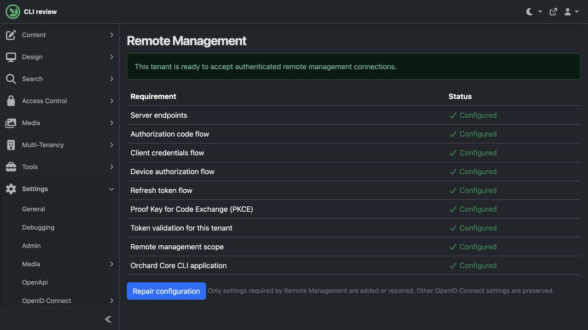
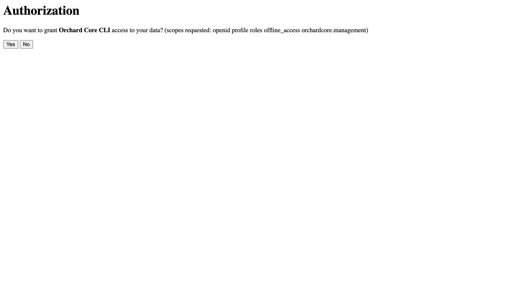
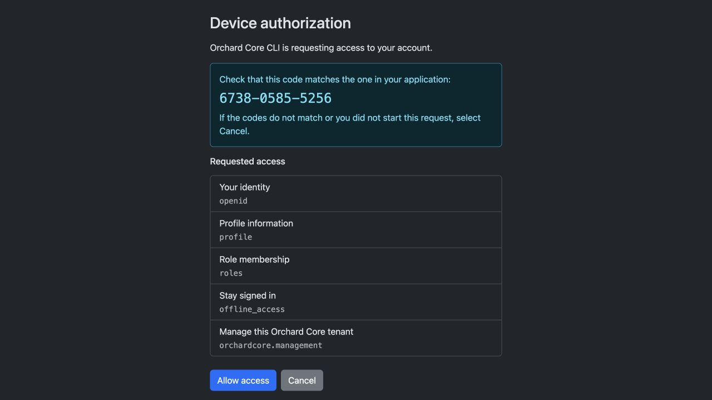

# Manage your first tenant with `oc`

The Orchard Core CLI brings tenant management to your terminal. Sign in once,
select a tenant, and discover the commands that its enabled features provide.
This walkthrough starts with a read-only content listing, then creates and
validates an unpublished article.

## 1. Download or build the CLI

The fork's [Remote management CLI workflow](https://github.com/sebastienros/OrchardCore/actions/workflows/remote_cli.yml)
builds downloadable native binaries on every branch push and on PR updates
targeting the fork.

1. Open the workflow run for the commit you want to try. For a PR targeting
   the fork, open **Checks**, then the **Remote management CLI** run.
2. Once the platform job succeeds, use its summary's **Download** link or
   select an artifact in the run's **Artifacts** section:

   | Your computer | Artifact |
   | --- | --- |
   | macOS, Apple Silicon | `oc-osx-arm64` |
   | macOS, Intel | `oc-osx-x64` |
   | Windows, x64 | `oc-win-x64` |
   | Windows, Arm64 | `oc-win-arm64` |
   | Linux, x64 | `oc-linux-x64` |
   | Linux, Arm64 | `oc-linux-arm64` |

3. Extract the downloaded artifact, then extract the `.tar.gz` or `.zip`
   native archive inside it. The artifact also includes its SHA-256 checksum
   and a verification record; the job summary identifies the built commit.
4. Put the extracted directory on your `PATH` and run `oc --version`.

You must be signed into GitHub to download workflow artifacts. These builds
are retained for 30 days and are unsigned development artifacts. For PR runs,
the built commit is GitHub's test merge commit; push runs build the pushed
commit. A newer PR update cancels its superseded PR build; push builds continue
so each pushed commit can publish its own packages.

### Install as a .NET tool

If you have the .NET 10 SDK or later, you can install and update `oc` through
`dotnet tool`. It installs a native executable for your platform; running
`oc` does not require a separately installed .NET runtime.

For a published push build, copy its version from the workflow's **Published to
Feedz** summary, then install directly:

```bash
dotnet tool install --global OrchardCore.Cli --add-source https://f.feedz.io/sebastienros/orchardcore/nuget/index.json --version <version>
oc --version
```

Use `dotnet tool update --global` with the same package/source and a newer exact
version to upgrade. All packages from a build share a version such as
`4.0.0-cli.25`: Orchard's version prefix and the workflow run number.
The native implementation is selected automatically for your computer.

To use a downloadable artifact instead (also available for PR builds):

1. From the same workflow run, download `oc-tool-<rid>` for your computer,
   such as **oc-tool-osx-arm64** for an Apple Silicon Mac.
2. Extract the artifact into a directory such as `oc-packages`. Keep the two
   `.nupkg` files together: the installer package and your platform's native
   implementation. Open `INSTALL.md` for a command with the exact build version.
3. Install from that directory, replacing `<version>` with the version in
   `INSTALL.md` or the job summary:

   ```bash
   dotnet tool install --global OrchardCore.Cli --add-source ./oc-packages --version <version>
   oc --version
   oc
   ```

   If `oc` is not found, add the tool directory printed by the installer to
   your `PATH` and open a new terminal.

To update, download the newer artifact and run:

```bash
dotnet tool update --global OrchardCore.Cli --add-source ./oc-packages --version <new-version>
```

For a project-local installation, run `dotnet new tool-manifest` if the project
does not already have a tool manifest, then use `--local` instead of `--global`.
Run it with `dotnet tool run oc -- <arguments>`. You can remove a global
installation with `dotnet tool uninstall --global OrchardCore.Cli`.

The development packages are available on Feedz and as workflow artifacts,
not on NuGet.org. `--add-source` adds your extracted packages to the configured
NuGet sources. Installation may also download an SDK launcher from NuGet.org.
The SDK selects the matching native package automatically. Both packages must
come from the same build. Each CI run has a distinct prerelease version so
an update selects the new executable.

### Test matching project templates and libraries

Install templates from the same successful push build:

```bash
dotnet new install OrchardCore.ProjectTemplates@<version> --add-source https://f.feedz.io/sebastienros/orchardcore/nuget/index.json
dotnet new occms -o MyOrchardSite
cd MyOrchardSite
dotnet new nugetconfig
dotnet nuget add source https://f.feedz.io/sebastienros/orchardcore/nuget/index.json --name OrchardCoreFeedz
dotnet restore
dotnet run
```

The template defaults to the matching Orchard package version. The local
`NuGet.Config` keeps the feed configuration with the generated project.
All packages retain their original IDs, including built-in themes such as
`TheAdmin` and `TheBlogTheme`; only their versions change for this feed.
Translation packs remain separate dependencies at the version pinned
by the repository.

The template pack also includes MVC websites, CMS/MVC modules, and themes. Add
`OrchardCore.RemoteManagement` and configure the tenant as described below when
testing CLI management against a generated site.

### Build from source

From a checkout containing `src/OrchardCore.Cli`, with the .NET SDK selected by
`global.json`, publish a native executable:

```bash
dotnet publish src/OrchardCore.Cli -c Release -r osx-arm64 -o artifacts/oc
./artifacts/oc/oc --version
```

Replace `osx-arm64` with your runtime identifier: `osx-x64`, `linux-x64`,
`linux-arm64`, `win-x64`, or `win-arm64`. Native publishing also requires the
platform's native compiler toolchain. Windows produces `oc.exe`.
Add the output directory to your `PATH`; the examples below use `oc`.

For development without native compilation, use
`dotnet run --project src/OrchardCore.Cli -- <command>`.

To create installable NativeAOT tool packages on your own computer:

```bash
dotnet pack src/OrchardCore.Cli -c Release -p:PackAsTool=true -o artifacts/tool
dotnet pack src/OrchardCore.Cli -c Release -p:PackAsTool=true -r osx-arm64 -o artifacts/tool
dotnet tool install --tool-path ./artifacts/bin OrchardCore.Cli --add-source ./artifacts/tool --version 1.0.0
./artifacts/bin/oc --version
```

Replace the runtime identifier for your platform. The first pack command
creates the installer package; the second builds the native implementation
on the matching operating system. Use the same `-p:Version=<version>` on both
pack commands when assigning a different package version. See the
[.NET NativeAOT tool packaging documentation](https://learn.microsoft.com/en-us/dotnet/core/tools/rid-specific-tools)
for details.

## Create and set up a local site

`oc install` creates a new CMS application and initializes its **Default**
tenant. It uses the `occms` template embedded in the CLI executable from the
same source build, with matching Orchard package versions. No template package
download, selected tenant context, or remote authentication is needed.
Other project templates remain available through `dotnet new`.

1. Install the stable .NET SDK matching the template's target framework
   (currently **.NET 10**), and make `dotnet` available on your `PATH`.
   `oc doctor` reports the selected SDK or a warning when it is unavailable.
   This SDK requirement applies to local site creation; remote management
   commands still work without .NET installed.
2. Choose a new or empty directory and create your site:

   ```bash
   oc install ./MyOrchardSite \
     --site-name "My Orchard Site" \
     --user-name admin \
     --email admin@example.com \
     --run
   ```

3. Enter the administrator password at the masked prompt. The CLI creates the
   project, restores dependencies, builds it, and uses
   [Auto Setup](../../reference/modules/AutoSetup/README.md) to initialize the
   site. Defaults are the `SaaS` recipe, SQLite, and the UTC time zone.
4. With `--run`, open `https://localhost:5001` when setup finishes. Sign in with
   the administrator account you just created. Press **Ctrl+C** to stop the
   foreground server. Use `--urls https://localhost:5080` to select another
   listening address.

HTTPS requires a certificate. For local development, create and trust the
.NET development certificate before using `--run`:

```bash
dotnet dev-certs https --trust
```

`--urls` accepts one address or a **quoted, semicolon-separated list** in a
single argument, following [ASP.NET Core's URL binding syntax](https://learn.microsoft.com/en-us/aspnet/core/fundamentals/servers/kestrel/endpoints?view=aspnetcore-10.0).
For example, to listen on both HTTPS and HTTP:

```bash
oc install ./MySite --site-name "My Site" --email admin@example.com \
  --run --urls "https://localhost:5001;http://localhost:5000"
```

Use HTTP(S) addresses with a hostname or IP address and an optional port, without
credentials, paths, queries, or fragments. Use `--request-url-prefix` for a site
path. The result's `url` selects the first HTTPS address, or the first address
when all use HTTP; `listenUrl` contains the complete semicolon-separated list.
For local HTTP without a certificate, specify `--urls http://localhost:5000`.

Installation shows concise progress messages. Add `--verbose` to see template,
build, and setup logs as they happen. On failure, the CLI prints recent
installation diagnostics automatically. Progress and logs go to standard error,
keeping JSON results on standard output usable by scripts. With `--run`, the
completed site's application logs stream to standard error.

The CLI initializes the Default tenant on a temporary loopback-only server
(`127.0.0.1` with an automatically chosen port). This address is internal to
setup; you do not need to open it. That server stops when setup finishes, before
`--run` starts the site at your chosen `--urls` address. Its startup logs appear
only with `--verbose` or in failure diagnostics. Without `--run`, no server is
left running. In JSON output, `tenantState:
"Running"` means the tenant is initialized; it does not mean a server was left
running. Start the site later with:

```bash
dotnet run --project ./MyOrchardSite --no-launch-profile --urls https://localhost:5001
```

The generated `global.json` pins the selected stable SDK, allowing later patches
in that SDK feature band. A project-local `NuGet.Config` supplies **nuget.org
only by default**, including for preview builds. Orchard dependencies retain
their original package IDs. Dependency restore still needs network access or
a populated package cache; embedding the template does not embed the runtime
or the site's packages. `--source` adds an explicit Orchard dependency feed
alongside nuget.org, using an HTTPS NuGet URL or local package directory. It
does not replace the embedded template or change the Orchard version.

For this fork's temporary CLI previews, whose matching packages are published
on Feedz, pass the feed explicitly:

```bash
oc install ./MyPreviewSite --site-name "My Preview Site" --email admin@example.com \
  --source https://f.feedz.io/sebastienros/orchardcore/nuget/index.json
```

`--site-time-zone` uses a case-sensitive [IANA/TZDB time zone ID](https://nodatime.org/TimeZones), as resolved
by Orchard's Noda Time database on every operating system. Examples are `UTC`
(the default), `America/Los_Angeles`, `America/New_York`, `Europe/Paris`, and
`Asia/Tokyo`. Use these identifiers rather than Windows names such as
`Pacific Standard Time`, abbreviations such as `PST`, or offsets such as `-08:00`.
Region IDs account for daylight saving time automatically. For example:

```bash
oc install ./ParisSite --site-name "Paris Site" --email admin@example.com \
  --site-time-zone Europe/Paris
```

Use the same argument names as tenant creation and setup, including
`--recipe-name`, `--database-provider`, `--table-prefix`, `--schema`,
`--site-time-zone`, `--request-url-prefix`, and `--request-url-host` (one host
name). For example, select `--recipe-name Blog` to initialize a blog.
`--setup-timeout` controls the initialization timeout in seconds (default 300).

For automation, supply the administrator password using exactly one of:

```bash
oc install ./MySite --site-name "My Site" --email admin@example.com --password-env OC_SITE_PASSWORD
oc install ./MySite --site-name "My Site" --email admin@example.com --password-file /run/secrets/site-password
printf '%s' "$OC_SITE_PASSWORD" | oc install ./MySite --site-name "My Site" --email admin@example.com --password-stdin
```

These are alternative commands for separate installations. Inject the secret
environment variable through your CI or secret manager. For a database that
requires a connection string, use `--connection-string-env`,
`--connection-string-file`, or `--connection-string-stdin`; only one secret can
consume stdin. There is no inline password or connection-string argument.

Auto Setup credentials are passed through the temporary process environment.
The administrator password is not written into generated settings, launch
profiles, or CLI output. Orchard stores the resulting account normally; it
also persists database connection settings needed to run the site. On macOS
and Linux, `oc install` creates `App_Data` with owner-only directory permissions.
If you deploy under another identity, grant that identity the access it needs.

The command refuses to overwrite existing content. On failure or cancellation,
it stops its child processes and preserves the project for inspection; it does
not silently retry a partially initialized database. Use a fresh directory for
a new attempt, or repair the preserved project manually. Creating a site does
not configure Remote Management automatically; follow the next section to
manage it through `oc`.

## 2. Prepare the tenant

Sign into the tenant's administration dashboard as an administrator. Enable
**Remote Management** under **Configuration → Features**, then open
**Settings → Remote Management**. Select **Configure Remote Management** or
**Repair configuration**. The page should report that the tenant is ready.



This configures the management scope, the public `orchardcore-cli` application,
PKCE, device authorization, refresh tokens, and local token validation.
The action preserves unrelated OpenID settings. For automation, the Remote
Management recipe performs the same configuration for the current tenant.

Your identity needs **Access remote management API** and the permissions for
the resources you will use. A production automation account should receive
only the permissions its job requires.

For a non-administrator identity, grant `AccessRemoteManagement` and the
permissions for the resources it will manage. If OpenAPI document access is
protected, also grant `ViewOpenApiContent` so the CLI can discover commands.
A readable management manifest followed by a 403 during `oc api refresh` can
indicate that this document permission is missing; signing in again does not
grant it.

## 3. Save the exact tenant URL

```bash
oc context add tutorial https://cms.example.com/news --current
oc context list
```

Replace the URL with your tenant's public base URL, including its path prefix.
Do not use the admin or login URL. A context named `tutorial` now selects that
one tenant. Commands use it until you select another context.

Both the context name and tenant URL are required. If either is omitted, the
CLI identifies the missing argument and displays the command's usage. Use
`oc context add --help` to view that help without creating a context.

Remote connections require HTTPS. HTTP is accepted for loopback development,
for example `http://127.0.0.1:5000/news`. To switch to another tenant URL, create
a new context name; existing credentials cannot follow a changed tenant URL.

## 4. Sign in once

```bash
oc login
```

The CLI opens the tenant's login page in your browser. Sign in as the intended
tenant-local user and approve the request. Return to the terminal to verify
that login completed.


On the authorization page, verify that the application is **Orchard Core CLI**
and select **Allow access**. The requested scopes include management access and
`offline_access`, which allows later commands to refresh your login silently.
Choose **Cancel** if you did not start this request. The page follows the
tenant's login theme; this example uses the default admin theme.
See [customizing authorization pages](../../reference/modules/OpenId/README.md#customizing-authorization-pages)
to apply your site's branding.



The callback page confirms **Authorization received** and directs you back to
the terminal. You can close that browser tab. The terminal reports
`Grant type: browser` and the tenant issuer when the token exchange succeeds;
receiving the authorization alone does not mean login has finished. The CLI
serves this page locally, with light and dark appearances and no external
assets. It is separate from the tenant's themeable consent page.

### Choose a login flow

| Where you run the CLI | Command | Where you sign in |
| --- | --- | --- |
| Your desktop or laptop with a browser | `oc login` | The browser opens on that computer; authorization code with PKCE is the default. |
| The same computer, but you want to open the browser yourself | `oc login --no-browser` | Copy the printed URL into a browser on that same computer. |
| An SSH session on a server without a desktop | `oc login --grant device` | Open the printed verification URL on your laptop or phone. |
| An interactive shell in a container or remote development environment | `oc login --grant device` | Use a browser outside that environment that can reach the tenant. |

Device authorization is still an interactive user login. For unattended CI
or scheduled jobs, configure a dedicated application identity and use
[client credentials](../../reference/api/authentication/README.md#client-credentials).
The CLI defaults to browser login; select device flow explicitly when needed.

### Sign in from another device

On the computer running the CLI, use:

```bash
oc login --grant device
```

The CLI prints a verification URL and a user code without opening a browser.
In a compatible terminal it also displays a QR code: scan it with your phone's
camera to open the same verification URL. The QR code is generated locally.
When the server supplies a URL containing the user code, that complete URL is
encoded; otherwise you enter the displayed code after scanning.

Control the terminal QR output with:

```bash
oc login --grant device --qr auto    # Default: show in a compatible terminal
oc login --grant device --qr always  # Force ANSI/Unicode QR output
oc login --grant device --qr never   # Keep just the URL and user code
```

Automatic mode skips QR output when standard error is redirected, the output
encoding is not UTF-8, `TERM=dumb`, or `NO_COLOR` is set to a nonempty value.
QR codes that do not fit the terminal width, or whose URL is too long, are
omitted in every mode. The URL and code remain available, and QR output goes
to standard error so it does not mix with JSON results on standard output.
QR output applies only to device login, since the browser login flow requires
its callback on the same computer.

For example, against a tenant reachable at `https://cms.example.com/team/`:

```text
Open https://cms.example.com/team/connect/verify?user_code=6738-0585-5256 and enter code 6738-0585-5256.
```

1. Keep the CLI command running.
2. Scan the QR code or open the printed URL on your phone or another computer. Both the CLI and
   that browser must be able to reach the tenant; a private tenant may require
   VPN access. A `localhost` or `127.0.0.1` tenant URL points to the device
   opening it and cannot be used from your phone to reach the CLI computer.
3. Sign in as the intended tenant user. If the URL already includes the code,
   it is filled in for you; otherwise enter the code printed by the CLI.
4. Verify the tenant, **Orchard Core CLI** application name, requested access,
   and matching code, then select **Allow access**. Only approve a request
   you started.
5. Return to the terminal. The CLI polls the tenant and completes login after
   approval, reporting `grantType: device`. If the code expires, run the login
   command again to obtain a new one.

The phone communicates with the tenant, not with a callback listener on the
CLI computer. Tokens are delivered to and stored on the computer running the
CLI; there is no token to copy from your phone. This is the
[OAuth device authorization grant](https://www.rfc-editor.org/rfc/rfc8628.html).



By comparison, `oc login` and `oc login --no-browser` use authorization code
with PKCE and a callback on the CLI computer's loopback interface. Opening
that flow's URL on your phone would direct the callback to the phone's own
loopback interface. Use device flow for this cross-device scenario.

### Reuse your login

Later commands reuse the login and refresh expiring tokens automatically.
On macOS and Linux, tokens remain in shared, owner-only files under
`~/.orchardcore/credentials`: directory mode `0700`, file mode `0600`.
They are plaintext and protected by your operating-system account permissions.
Routine commands do not open the OS secret store or prompt for authentication.
Windows uses Windows Credential Manager.

## 5. Run your first command

```bash
oc content items list --take 10
```

In a terminal, the result is a table. An empty result means there are no items
matching the default published-content filter; it does not mean login failed.
To see drafts:

```bash
oc content items list --status draft --take 10
```

`--skip` is a zero-based offset. For the next page, use `--skip 10 --take 10`.
Capture a complete, stable response for scripts with explicit JSON output:

```bash
oc content items list --status draft --output json > drafts.json
```

The default `human` output reports successful changes in plain language and
shows useful details with complete URLs. For example, `oc tenants create`
reports the created tenant and its full **Setup URL**, so you can open it to
finish setup. Single-resource responses use readable labels. Lists and search
results remain tables, and `schema` commands retain JSON Schema output.

Human output remains the default when redirected. **Scripts must request
`--output json` explicitly** for a stable, complete response. Other explicit
formats include `table`, `csv`, `tsv`, `yaml`, `toml`, and `none` (no result
output). `--output auto` selects human output in a terminal and JSON when
redirected. Tables may shorten long non-URL cells; HTTP and HTTPS URLs remain
complete in both human and table output.

```bash
oc tenants create --name Demo --request-url-prefix demo
oc tenants create --name Demo --request-url-prefix demo --output json
```

Successful changes receive a completion message. An HTTP 202 response is
described as accepted rather than finished; an API-reported unsuccessful result
does not receive a success message. Errors still appear on standard error.

## 6. Discover before writing

Run `oc` or `oc --help` to see the same help: built-in commands and the selected
context's tenant commands from the local OpenAPI cache. Neither form contacts
the tenant or requires authentication. Expired cached commands remain visible
with a stale-cache warning. If no cached metadata is available, only built-in
commands appear; authenticate and run `oc api refresh` to populate the cache.

```bash
oc --help
oc content items --help
oc content types schema --output json
oc content items schema Article --output json
```

The last command requires an existing `Article` content type. If it is absent,
create the simple type below. If it already exists, inspect its schema and
adapt the article payload to that model instead of replacing the definition.
This example needs the Contents, Content Types, and Title features.

Save this as `article-type.json`:

```json
{
  "name": "Article",
  "displayName": "Article",
  "settings": {
    "ContentTypeSettings": {
      "creatable": true,
      "listable": true,
      "draftable": true,
      "versionable": true
    }
  },
  "parts": [
    { "name": "TitlePart", "partName": "TitlePart", "settings": {} }
  ]
}
```

```bash
oc content types create --body-file article-type.json
oc content items schema Article --output json
```

Definition DTOs use camelCase. Content-item parts and properties preserve their
schema casing, including `ContentType`, `TitlePart`, and `Title`.

## 7. Create and check a draft

Save this as `article.json`:

```json
{
  "ContentType": "Article",
  "TitlePart": { "Title": "My first CLI article" }
}
```

```bash
oc content items validate --body-file article.json
oc content items create-draft --body-file article.json --output json
```

Validation should return `isValid: true`. Copy the returned `ContentItemId`
into the commands below:

```bash
oc content items show <content-item-id> --version draft --output json
oc content items render <content-item-id> --version draft
oc content items validate-update <content-item-id> --body-file article.json
```

The item remains unpublished. `validate-update` validates a detached candidate;
it does not save it or run update workflows. Reading `--version draft` never
creates a draft; it returns `404` when no draft exists. To publish intentionally:

```bash
oc content items publish <content-item-id>
```

Do not retry creation blindly after a connection failure: a request may have
succeeded before its response was lost. Read back the state first. Consult the
[content API retry contract](../../reference/api/content-items/README.md) for
updates, lifecycle operations, and deletes.

## 8. Use contexts and secrets deliberately

Use `oc --context production <command>` to make the destination explicit.
Destructive commands marked for confirmation ask in an interactive terminal;
noninteractive callers must supply `--yes`. `oc context clear --force` removes
all saved contexts and their credentials, so use it only for an intentional reset.

For unattended jobs, register a separate **confidential** OpenID application
with client-credentials flow, the `orchardcore.management` scope, and minimal
roles. Inject `OC_CLIENT_ID` and `OC_CLIENT_SECRET` through your CI secret
facility, then run ordinary commands:

```bash
oc --context production content items list --output json
```

Do not use the public `orchardcore-cli` application for this grant.
Client credentials and their tokens are not persisted. For user provisioning,
use `--password-env`, `--password-file`, or `--password-stdin` with individual
property options; alternatively supply the entire request in a protected
`--body-file` or `--stdin`. Do not combine a complete body with property options.

## Upload custom styles and other assets

Use the Media library for custom assets so the CLI and Orchard admin UI share
files and permissions. After signing in, inspect `oc media constraints show`
and choose a folder convention for your project. For example, with local
`site.css` ready to upload:

```bash
oc media constraints show --output json
oc media folders create --name assets
oc media folders create --path assets --name styles
oc media files upload site-v1.css --path assets/styles --file ./site.css
oc media files show assets/styles/site-v1.css --output json
```

Create the folders only if they do not already exist. The upload needs Media
management and destination-folder permission. By default CSS, JavaScript, and
SVG additionally require **Upload media file extensions requiring additional
permission** (`UploadRestrictedMedia`);
ask your administrator for the appropriate access if the extension is absent
from your constraints. Use the returned `url` to reference the stylesheet and
`filePath` for Media fields or Liquid's `asset_url` filter. You can also find the
file in the admin Media library. Uploads reject existing names, so choose a new
versioned name when updating an asset.

See [Media and custom assets](../../reference/modules/RemoteManagement/README.md#media-and-custom-assets)
for shared storage across nodes and the [Media API](../../reference/api/media/README.md)
for the complete contract. Tenant static files are deployment assets and have no
management API.

## Troubleshooting and next steps

| Symptom | Next step |
| --- | --- |
| Command missing from help | Check the selected context and enabled features; run `oc api refresh --force` |
| `401` | Verify the context and sign in again, or check injected client credentials |
| `403` | Check both management access and the resource-specific tenant permissions |
| `404` for a draft | Verify the ID and whether a draft exists; inspect the latest version |
| Validation failure | Correct the named property using the live schema and exact casing |
| Local storage or cache problem | Run `oc doctor` to inspect paths and storage availability |
| Protocol mismatch | Run `oc api compatibility` and use a compatible CLI version |

Help and shell completion use cached metadata without contacting the server.
After feature changes, successful mutations expire discovery caches so the next
online command can refresh them. `oc --version` prints the CLI version number.
`oc doctor` reports the CLI version, platform, and local
storage and cache state without contacting the tenant. Use
`oc doctor --output json` for structured diagnostics in scripts.
For Bash completion, run `oc completion --shell bash > oc-completion.bash` and
source the file. Other supported shells are `zsh`, `fish`, and `pwsh`.

Sign out of the current context with `oc logout`. It attempts token revocation
and removes stored human credentials on success. Disconnecting a terminal or
closing a shell does not log you out.

Continue with the [complete management API reference](../../reference/api/README.md),
[CLI reference](../../reference/modules/RemoteManagement/README.md), and
[verification record](../../reference/modules/RemoteManagement/review.md).
Agent skills and plugin packaging are documented in
[the repository test toolkit](https://github.com/sebastienros/OrchardCore/tree/sebros/remote-tenant-cli-plan/.scripts/remote-management).
